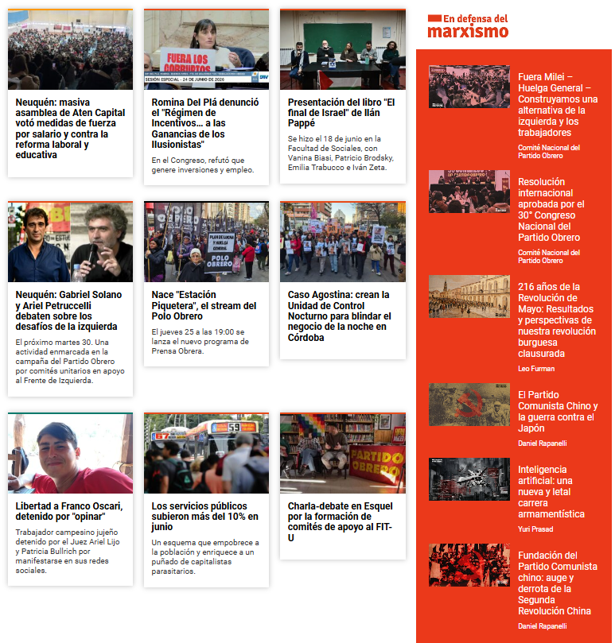
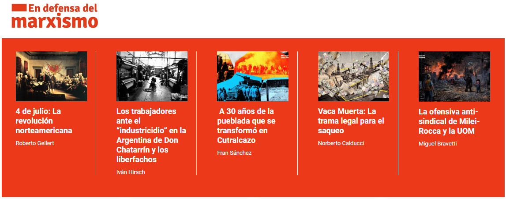

# PO Builder Implementation Guide

## Estado actual

### Modelo

El builder usa **regiones por plantilla**: cada `Region` declara una `template: TemplateId` y trae un array `blocks: (Block | null)[]` cuya longitud está fijada por el `TemplateSpec`. No hay regiones libres ni columnas configurables — la plantilla define el grid CSS, la cantidad de slots y la variante visual de cada slot.

Templates disponibles (en `src/types/layout.ts → TEMPLATE_SPECS`):

| TemplateId | Slots | Layout |
|---|---|---|
| `nota-principal` | 1 | 1 col, card hero |
| `tres-notas-principales` | 3 | grid asimétrico: 1 grande + columna de 2 |
| `dos-notas-secundarias` | 2 | 2 col iguales con foto |
| `tres-notas-secundarias` | 3 | 3 col iguales con foto |
| `cuatro-notas-secundarias` | 4 | 4 col iguales con foto |
| `cuatro-notas-sin-foto` | 4 | 4 col sólo texto con border top coloreado |
| `cuadricula` | 6 | grid 3×2: 4 tarjetas (izq, 2×2) + 2 banners (der, apilados) |
| `banner` | 1 | full width, imagen + URL editable |

Cada slot tiene una `SlotVariant` (`hero | main-left | main-right | secondary-photo | secondary-small | secondary-text | banner`) que el consumidor usará para decidir qué componente de card renderizar en producción.

### Architecture Overview

```
App.tsx (carga layout de Supabase)
├── BuilderToolbar (Save / Publish / Undo / Redo)
├── Sidebar (tabs Artículos / Banners)
│   ├── ArticleBrowser (search + paginación)
│   │   └── ArticleCard (draggable, data.type = "article")
│   └── BannerLibrary (search + grid de medios WP)
│       └── BannerMediaCard (draggable, data.type = "banner")
└── Canvas (DndContext)
    └── RegionList (SortableContext de regiones)
        └── RegionItem (drag handle + header + delete + badge "slots vacíos")
            ├── RegionTemplate (grid CSS según TemplateSpec)
            │   └── SlotCell (droppable por slot)
            │       └── SlotBlock (draggable, despacha según block.type)
            │           ├── SlotArticleBody
            │           │   ├── HeroCard
            │           │   ├── MainLeftCard
            │           │   ├── MainRightCard
            │           │   ├── SecondaryPhotoCard
            │           │   ├── SecondarySmallCard
            │           │   └── SecondaryTextCard
            │           └── SlotBannerBody (imagen + input URL destino)
            └── AddRegionModal (grid visual de los 7 templates)
```

### State Management — `src/store/layoutStore.ts`

Zustand store envuelto en `persist` middleware (autosave a `localStorage`, ver Phase 4.5). Historia para undo/redo de 20 pasos en memoria — no se persiste. Acciones reales:

- `initializeLayout(slug, existing?)` — compara local vs remoto y decide quién gana (ver Phase 4.5)
- `addRegion(template)` — precrea N slots `null` según `TemplateSpec.slotsCount`
- `deleteRegion(regionId)` / `reorderRegions(ids[])`
- `setSlotBlock(regionId, slotIndex, block)` — asigna `ArticleBlock | BannerBlock` al slot (reemplaza si hay algo)
- `clearSlot(regionId, slotIndex)`
- `swapSlots(fromRegionId, fromSlot, toRegionId, toSlot)`
- `updateBannerLinkUrl(regionId, slotIndex, url)` — sólo válida para slots tipo banner
- `save()` — insert de nueva versión en Supabase + limpia `isDirty` y `lastLocalSave`
- `publish()` — valida slots; bloquea si hay `null` o banners sin `linkUrl`
- `discardLocalDraft()` — re-fetch desde Supabase, descarta el draft local
- `acknowledgeDraftRestored()` — limpia el flag `draftRestored` sin descartar el draft
- `undo() / redo() / canUndo() / canRedo()`

Estado persistido en `localStorage` bajo clave `po-builder:layout:home`. Whitelist: `{ layout, slug, isDirty, lastLocalSave }`.

### Drag & Drop — `src/hooks/useDragHandlers.ts` + `dnd-kit`

IDs y data shapes:

- Droppables de slot: `id = "slot:${regionId}:${slotIndex}"`, `data = { kind: "slot", regionId, slotIndex }`
- Draggables de sidebar:
  - Article: `data = { type: "article", articleId, snapshot }`
  - Banner: `data = { type: "banner", bannerData: { mediaId, imageUrl, altText, linkUrl: "", openInNewTab } }`
- Draggable in-slot: `data = { kind: "slot-article", regionId, slotIndex }`
- Sortable de regiones: `useSortable({ id: region.id })` en RegionItem

Escenarios manejados por `useDragHandlers`:

1. **Sidebar → slot** (`type: article|banner` + `kind: slot`) — usa `slotVariantAt` + `slotAcceptsBanner` para rechazar mismatches (artículo a slot banner o viceversa).
2. **Slot → slot** (`kind: slot-article` + `kind: slot`) — `swapSlots`. Si los slots de origen y destino no aceptan el mismo tipo, el swap se descarta.
3. **Region reorder** — drag del handle en `RegionItem`, dispara `reorderRegions`.

### GraphQL — `src/lib/graphql.ts`

Dos queries contra `VITE_GRAPHQL_ENDPOINT` (WPGraphQL de prensaobrera.com), ambas con paginación cursor-based:

- `searchArticles(query, after?, first?)` — usada por `useArticles` (hook `react-query`). Devuelve `Article[]` con `snapshot`-friendly fields (`title`, `excerpt` desde `campos.descripcionDestacado`, `volanta`, `categoryName`, etc.).
- `fetchMediaItems(query, after?, first?)` — usada por `useMedia`. Devuelve sólo items con `mimeType: image/*`.

### Persistencia — `src/lib/supabase.ts`

- `loadLayout(slug)` — última versión `is_published = false` de ese slug.
- `saveLayout(layout)` — **insert** de nueva fila, nunca update (version++).
- `publishLayout(slug, version)` — pone `is_published = true` en esa versión y lo limpia en las demás del mismo slug.

### Colores por sección — `src/lib/sectionColors.ts`

Paleta `SECTION_COLORS` por slug de sección, espejada también en `tailwind.config.ts` bajo `colors.section.*`. Helper `getSectionColor(categoryName)` normaliza el nombre (strip de tildes + lowercase + spaces→hyphens) y devuelve hex con fallback gris.

Aplicada en:

- `ArticleCard` (sidebar): barra vertical de 3px + color de la volanta/categoría
- `RegionTemplate`: volantas de hero / main-left / main-right + border-top y volanta de `secondary-text`

---

## Hoja de ruta

### Phase 1-2 — Scaffold + Canvas

Cerradas.

### Phase 3 — Integración GraphQL

Cerrada para artículos y para banners (media items). Pendiente:

- [ ] Validar fallback si WPGraphQL no soporta `sourceUrl(size: MEDIUM)` (hoy va con alias `mediumSourceUrl`)
- [ ] Proxy de Vite si aparece CORS en producción del builder

### Phase 4 — Testing & polish

Hecho:

- [x] Drag artículo → slot
- [x] Drag banner → slot con URL editable in-place
- [x] Swap intra/inter-región
- [x] Reorder de regiones
- [x] Validación de publicar con slots vacíos o banners sin URL
- [x] Paleta de colores por sección en sidebar y border-top de cards
- [x] Reset automático de layouts persistidos con shape viejo

Pendientes:

- [ ] Toast/feedback global en lugar del mensaje inline en toolbar
- [ ] Sombras en tarjetas
- [ ] Autenticación
- [ ] Poder guardar layout como plantilla
- [ ] Cargar plantillas guardadas
- [ ] Retry/backoff en errores de Supabase
- [ ] Loading skeletons en `ArticleBrowser` / `BannerLibrary`

### Phase 4.5 — Persistencia local y autosave

**Implementación (Opción A — sólo localStorage):**

- [x] "Guardar" manual a Supabase (`layoutStore.save`)
- [x] Persistencia local automática vía `zustand/middleware → persist`, clave `po-builder:layout:home`
- [x] Indicador visual en toolbar: chip "Guardado local hace Xs" junto al state badge, refresh cada 1s
- [x] Recuperación al cargar: si el local tiene `isDirty` y `lastLocalSave > remote.updated_at`, se queda con el local y marca `draftRestored = true`
- [x] Banner ámbar con CTA "Cargar versión guardada" cuando `draftRestored` (dispara `discardLocalDraft`)
- [x] Whitelist mínima en `partialize`: `{ layout, slug, isDirty, lastLocalSave }`. La historia de undo/redo NO se persiste.

**Pendientes (Fase 2 — Opción B, autosave periódica a Supabase):**

- [ ] Decidir si se siguen creando filas nuevas en `page_layouts` o se hace upsert sobre el draft activo (insert-only spamearía el historial de versiones)
- [ ] Throttle/timer (e.g. cada N minutos, sólo si `isDirty`)
- [ ] Resolución de conflicto si otro dispositivo modificó el mismo slug en paralelo

**Opciones analizadas y registradas para el futuro:**

| Opción | Pros | Contras |
|---|---|---|
| **A. Sólo localStorage** (implementada) | Instantáneo, sin red, sobrevive a F5 y cierre de tab | No sincroniza entre dispositivos; vuela si el usuario limpia datos del navegador |
| **B. Autosave periódica a Supabase** | Backup real accesible desde otro dispositivo | Ruido en `page_layouts` (1 fila por tick); requiere upsert o throttle agresivo |
| **C. Híbrido** (A + B) | Lo mejor de ambos: feedback instantáneo + backup remoto | Más piezas; lógica de "qué versión gana" al cargar |

**Flujo de carga (`initializeLayout`):**

1. zustand rehidrata el state desde `localStorage` antes de que monte React (sincrónico).
2. `App.tsx` llama `loadLayout("home")` contra Supabase.
3. `initializeLayout(slug, remote)` corre 3 ramas:
   - **No hay local válido** → carga remoto (o crea layout vacío).
   - **Local dirty y más nuevo que remoto** → mantiene local y prende `draftRestored`.
   - **Remoto gana** → reemplaza local y limpia `lastLocalSave`.
4. Si `draftRestored === true`, la toolbar muestra el banner ámbar con CTA para descartar local.
5. `save()` exitoso limpia `lastLocalSave + isDirty + draftRestored`.

### Phase 5 — Publishing + consumer Next.js

**TODO:**

1. Validar publish end-to-end:
   - [ ] Confirmar `is_published` único por slug
   - [ ] Dropdown de versiones en la toolbar para revertir
2. Consumer en `prensaobrera.com` (Next.js App Router):
   ```tsx
   // app/page.tsx
   import { createClient } from "@supabase/supabase-js";
   import { PageRenderer } from "@/components/po-builder/PageRenderer";

   export default async function HomePage() {
     const supabase = createClient(/* ... */);
     const { data } = await supabase
       .from("page_layouts")
       .select("layout")
       .eq("slug", "home")
       .eq("is_published", true)
       .single();
     return <PageRenderer layout={data.layout} />;
   }
   ```
3. `PageRenderer` decide por `region.template` qué grid CSS aplicar y por `slot.variant` qué componente de card renderizar:
   - Una entrada por `TemplateId` con el `gridTemplateAreas` real del sitio (puede diferir del preview del builder en márgenes/espaciados)
   - Una entrada por `SlotVariant` que mapea a una card del design system de PO (hero, main-left, secondary-photo, etc.)
4. Banners: render `<a href={banner.linkUrl} target={banner.openInNewTab ? "_blank" : undefined}></a>`.

### Pendientes generales
- [x] Sombras en tarjetas
- [x] Autenticación
- [ ] Poder guardar layout como plantilla
- [ ] Cargar plantillas guardadas
- [x] Crear Editor de página con distinto slug
- [x] Task "newregioncuadricula": Crear región "cuadricula" guardada en regiones/cuadricula.png. Esta región tiene dos columnas, en la columna izquierda entran 4 slots con tarjetas y en la derecha hay dos slots para banners.
- [x] Task "newRegionEDM": Crear región "Mas notas EDM" como se indica en la imagen "". En la columna izquierda entra una grilla de 9 slots de 3x3 y en la columna derecha 6 slots verticales con un diseño de tarjeta específico: "NotaEDM.tsx" que debe tener imagen a la izquierda y Titulo + Autor a la derecha.
- [x] Task: "UserEditPages": Cuando un usuario está editando una página, los demás usuarios no deberían poder entrar hasta que el usuario la "libere". Debe poder "expulsar" al usuario mediante un mensaje de confirmación. En la lista de páginas debe reflejarse que el usuario que la está editando. Usar /grill-with-docs y /ponytail.
- [ ] Task: "PageMetaData": Se debe poder incluir metadata a las páginas (solo a páginas que no sean la Home). Una opción sería que dentro del editor exista una columna fija a la derecha con los campos necesarios para que la página esté bien optimizada con su metadata (incluida una imagen). Usar /grill-with-docs y /ponytail.
- [x] Task: "FixedAddRegionButton": Agregar boton fixed abajo a la derecha dentro del editor para agregar nueva región. Mantener el existente. El objetivo es que el usuario no tenga que scrollear para ver que puede agregar región.
- [x] Task: "EDM-Region-Horizontal": Crear nueva región con fondo rojo y 5 notas horizontales como lo muestra la siguiente imagen . Usar skills grill-with-docs y ponytail si hacen falta.
- [x] Task: "SlotsOpcionales": La region "MasNotasEdmTemplate" no deberia tener slots obligatorios. Si el usuario carga menos notas no debería haber problemas para publicar.
- [ ] Administrar usuarios
- [x] Task: "ReviewFieldCategorySlug": Revisar la implementación de un nuevo campo "categorySlug"
- [ ] Task: "TabMetadata": Add Tab metadata to the left sidebar, separing "Contenido > Articulos, EDM, Banners" to "Metadata: Titulo, Descripcion, Imagen, etc". Se deben agregar los campos de metadata a supabase. Utilizar las skills necesarias.
- [x] Task: "GuardarAntes": Solo se debería poder publicar si la pagina ya está guardada, de lo contrario, el boton publicar debe estar en gris y deshabilitado.
- [x] Task: "Webhooks". Crear implementación para que al publicar se dispare un webhook para revalidar las paginas estaticas de mi aplicación externa en nextjs. La implementación en NextJS es la siguiente: 
   ``` 
   export default async function handler(req, res) {
      if (req.query.secret !== process.env.MY_SECRET_TOKEN) {
         return res.status(401).json({ message: "Invalid token" });
      }

      const { slug } = req.query;
      if (!slug) {
         return res.status(400).json({ message: "Missing slug" });
      }

      try {
         await res.revalidate(`/${slug}`);
         return res.json({ revalidated: true, slug });
      } catch (err) {
         return res.status(500).send("Error revalidating");
      }
   }
   ``` 
   Y la recomendación sería la siguiente: 
    ``` 
     Desde el builder llamás:                               
     GET /api/revalidate-page?secret=TU_TOKEN&slug=home    
     Para slugs anidados (seccion/nota) el slug va tal
     cual: ?slug=seccion/nota.
    ```
    El token en cuestión es: (P4rt1d0)2019.
    Invocar las skills necesarias: ponytail, arquitectura, buenas practicas.
- [x] Task: "BannerStorage". Modificar la pestaña de banners para que se pueda subir imagenes a supabase directamente y no buscar en wordpress. El bucket debe llamarse banners. Debe haber un sistema de compresión y restricción de imagenes pesadas. No aceptar imagenes de mas de 3MB. Y de dimension 1920x1080. Las imagenes pueden ser .jpg .jpeg .png .webp. La implementación de la búsqueda en wordpress no debe eliminarse ya que es una prueba de concepto.
- [ ] Agregar roles / permisos a usuarios
- [ ] Retry/backoff en errores de Supabase
- [ ] Configurar MCP de github para sincronizar issues
- [x] Loading skeletons en `ArticleBrowser` / `BannerLibrary`

---

## Quick start

- [ ] `cp .env.example .env` y completar `VITE_SUPABASE_URL`, `VITE_SUPABASE_ANON_KEY`, `VITE_GRAPHQL_ENDPOINT`
- [ ] Aplicar `migrations/001_create_page_layouts.sql` en Supabase
- [ ] `npm run dev` → `localhost:5173`
- [ ] Agregar una región desde "Agregar región" y arrastrar un artículo o banner

---

## Key files

| Archivo | Para qué |
|---|---|
| `src/types/layout.ts` | Tipos + `TEMPLATE_SPECS` (source of truth) |
| `src/store/layoutStore.ts` | Estado + acciones del builder |
| `src/lib/supabase.ts` | `loadLayout / saveLayout / publishLayout / getLayoutVersions` |
| `src/lib/graphql.ts` | `searchArticles`, `fetchMediaItems` (WPGraphQL) |
| `src/lib/sectionColors.ts` | Paleta + normalizador `sectionSlug` + `getSectionColor` |
| `src/hooks/useArticles.ts` | `useInfiniteQuery` para artículos |
| `src/hooks/useMedia.ts` | `useInfiniteQuery` para banners (media items) |
| `src/hooks/useDragHandlers.ts` | Despacho de los 3 escenarios de DnD |
| `src/App.tsx` | DndContext + bootstrap del layout |
| `src/components/builder/Canvas.tsx` | Hub del canvas |
| `src/components/builder/RegionList.tsx` | SortableContext de regiones |
| `src/components/builder/RegionItem.tsx` | Header + sortable de cada región |
| `src/components/builder/RegionTemplate.tsx` | Grilla de slots + cards |
| `src/components/builder/AddRegionModal.tsx` | Selector visual de templates |
| `src/components/sidebar/Sidebar.tsx` | Tabs Artículos/Banners |
| `src/components/sidebar/ArticleBrowser.tsx` + `ArticleCard.tsx` | Bibloteca de artículos |
| `src/components/sidebar/BannerLibrary.tsx` + `BannerMediaCard.tsx` | Biblioteca de medios para banners |
| `src/components/DragOverlayContent.tsx` | Preview visual de lo que se está arrastrando |
| `tailwind.config.ts` | Paleta `colors.section.*` (mirror de `sectionColors.ts`) |
| `migrations/001_create_page_layouts.sql` | Schema Supabase |

---

## Dependencias

- React/UI: `react`, `react-dom`, `tailwindcss`
- Estado: `zustand` (con `zustand/middleware` disponible para `persist`)
- Drag & Drop: `@dnd-kit/core`, `@dnd-kit/sortable`, `@dnd-kit/utilities`
- Backend: `@supabase/supabase-js`
- Data fetching: `@tanstack/react-query`
- Build: `vite`, `typescript`
- IDs: `uuid`

---

## Known issues / TODOs

- [ ] Si WPGraphQL del cliente no acepta `sourceUrl(size: MEDIUM)` en `mediaItems`, sacar el alias `mediumSourceUrl` y usar sólo `sourceUrl`
- [ ] CORS para producción del builder (Vite proxy o Edge Function)
- [ ] Sin upload de imágenes propias en builder (todo viene de la media library de WP)
- [ ] Mobile responsiveness (UI pensada para desktop)
- [ ] Accesibilidad (faltan aria labels, navegación con teclado completa)
- [ ] Error boundaries
- [ ] **Seguridad RLS:** la política de Supabase está abierta al rol `anon` (cualquiera con la anon key puede insertar/leer/borrar). Está bien para builder interno en dev; antes de exponerlo en producción hay que agregar Supabase Auth y restringir la policy a `authenticated`.

---

## Performance

- Layout JSON: ~25kB para 50 bloques (dentro de límites razonables)
- Historia: 20 pasos para acotar memoria
- DnD: `@dnd-kit` con `collisionDetection = rectIntersection` y modifiers mínimos
- Render: si aparece jank, `React.memo` en `SlotCell` y `SlotBlock` es el primer paso

---

## Troubleshooting

**Layout no carga**
- Revisar `VITE_SUPABASE_*` en `.env`
- Verificar que la tabla `page_layouts` existe y la anon key tiene permisos de SELECT
- Network tab: 401/403 → políticas RLS

**Drag no funciona**
- Confirmar que `DndContext` envuelve sidebar + canvas (está en `App.tsx`)
- `console.log(active.data.current, over?.data.current)` dentro de `useDragHandlers` para ver el shape de cada drag
- Para variantes mismatch (e.g. artículo a slot banner) el handler descarta silenciosamente — no es un bug

**Búsqueda de artículos vacía**
- Verificar `VITE_GRAPHQL_ENDPOINT`
- Probar la query a mano contra el endpoint
- Si CORS bloquea, configurar proxy en `vite.config.ts`

**Banners no aparecen en la sidebar**
- Probar la query `mediaItems` directo contra WPGraphQL
- Si el cliente no expone `sourceUrl(size: MEDIUM)`, simplificar la query (ver "Known issues")

**Migración Supabase tira `syntax error at or near "not"` en `create policy`**
- Postgres no soporta `CREATE POLICY IF NOT EXISTS`. La migración usa `DROP POLICY IF EXISTS … ; CREATE POLICY …` y es idempotente — se puede correr varias veces.

**"Guardar" no escribe en Supabase pero el draft sigue vivo en F5**
- Revisar `.env` — si `VITE_SUPABASE_URL` o `VITE_SUPABASE_ANON_KEY` quedaron con los placeholders del `.env.example`, los `fetch` a Supabase fallan en silencio y el localStorage sigue funcionando independientemente.
- Reiniciar `npm run dev` después de tocar el `.env` (Vite no relee env en caliente).

**Quiero forzar la carga del remoto y descartar mi draft local**
- En la toolbar, si aparece el banner ámbar "Se restauró un borrador local", apretar "Cargar versión guardada".
- Alternativa manual: DevTools → Application → Local Storage → borrar la entrada `po-builder:layout:home` y recargar.
